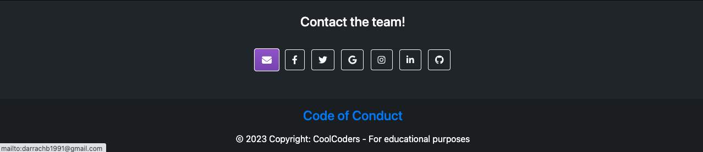

# CoolCoders-PP4

[Link to deployed site](https://coolcoders-b69260c4617a.herokuapp.com/)

Cool Coders is your go-to hub for all things tech, offering a wealth of insightful posts on coding, industry trends, gadgets and more. Engage with a global community by favoriting posts, leaving comments, and sparking discussions. Share your own tech experiences through user-generated posts. Join Cool Coders today and immerse yourself in the dynamic world of technology.

# Table Of Content

- [User Experience](#user-experience)
  - [User Stories](#user-stories)
  - [Site Goals](#site-goals)
  - [Scope](#scope)
- [Design](#design)
  - [Colour Scheme](#colour-scheme)
  - [Database Schema](#database-schema)
  - [Fonts](#fonts)
  - [Wireframes](#wireframes)
  - [Agile Methodology](#agile-methodology)
    - [Overview](#overview)
    - [EPICS(Milestones)](#epics---milestones)
    - [User Stories Issues](#user-stories---issues)
    - [MoSCoW prioritization](#moscow-prioritization)
    - [GitHub Projects](#github-projectskanban)
- [Features](#features)
  - [Navigation Header](#navigation-header)
  - [Footer](#footer)
  - [Home Page](#home-page)
  - [Post Detail Page](#post-detail-page)
  - [Profile Page](#profile-page)
  - [Edit/Add Post Page](#addedit-post-page)
  - [Edit Profile Page](#edit-profile-page)
  - [Sign Up Page](#sign-up-page)
  - [Sign In Page](#sign-in-page)
  - [Sign Out Page](#sign-out-page)
  - [Article Preview Card](#article-preview-card)
  - [Notification Messages](#notification-messages)
  - [Confirmation Modal](#category-model)
  - [Toggle Favourites](#toggle-favourites)
  - [Comment Card](#comment-card)
  - [Comment Form](#comment-form)
  - [Error Pages](#comment-form)
  - [Future Features](#future-features)
- [Testing](#testing)
- [Bugs](#bugs)
- [Technologies and Languages](#technologies-and-languages)
  - [Languages](#languages-used)
  - [Python Modules](#python-modules-imported)
  - [Technologies and programs](#technologies-and-programs)
- [Deployment](#deployment)
  - [Pre Deployment](#pre-deployment)
  - [Deploying on Heroku](#deploying-on-heroku)
  - [Fork the Repository](#fork-the-repository)
  - [Clone the Repository](#clone-the-repository)
  - [Run the Repository Locally](#run-the-repository-locally)
- [Credits](#credits)
  - [Content](#content)
  - [Media](#media)
  - [Code](#code)
  - [Acknowledgements](#acknowledgements)

## User Experience

### User Stories

#### New User

1. As a user I want the website to be responsive so I can view it on multiple devices [#6](https://github.com/DarrachBarneveld/CoolCoders-PP4/issues/6)
2. As a User I can intuitively navigate through the website so that I can view all content with ease. [#7](https://github.com/DarrachBarneveld/CoolCoders-PP4/issues/7)
3. As a User, I can create an account so that I can post, save and edit content [#8](https://github.com/DarrachBarneveld/CoolCoders-PP4/issues/8)
4. As a User, I can log out so that I can secure my account from potential hacks [#10](https://github.com/DarrachBarneveld/CoolCoders-PP4/issues/10)
5. As a User, I can post an article so that I can share my insights with the community. [#12](https://github.com/DarrachBarneveld/CoolCoders-PP4/issues/12)
6. As a User, I can create comments on articles, so that I can engage with the content and share my thoughts. [#14](https://github.com/DarrachBarneveld/CoolCoders-PP4/issues/14)
7. As a User, I can delete my own comments, so that I can remove unwanted opinions. [#15](https://github.com/DarrachBarneveld/CoolCoders-PP4/issues/15)
8. As a User, I can view content on the home page so that I can stay informed and explore engaging topics. [#16](https://github.com/DarrachBarneveld/CoolCoders-PP4/issues/16)
9. As a User, I can view a selected article with its comments, as well as related articles, so that I can explore in-depth content and engage with the community. [#17](https://github.com/DarrachBarneveld/CoolCoders-PP4/issues/17)
10. As a User, I can filter articles to a specific category, so that I can explore content that interests me. [#18](https://github.com/DarrachBarneveld/CoolCoders-PP4/issues/18)
11. As a User, I can view a user's profile page, displaying their posts, favourites and basic information so that I can learn more about the user and their contributions. [#19](https://github.com/DarrachBarneveld/CoolCoders-PP4/issues/19)
12. As a User, I can add articles to my favourites so that I can save my most enjoyed articles for future reference. [#20](https://github.com/DarrachBarneveld/CoolCoders-PP4/issues/20)
13. As a User I can see notification messages when performing CRUD operations or login/logout, signup so that informed about the outcome of the action taken. [#29](https://github.com/DarrachBarneveld/CoolCoders-PP4/issues/29)
14. As a User, I want to view comments on an article so that I can see the discussions going on a particular topic. [#33](https://github.com/DarrachBarneveld/CoolCoders-PP4/issues/33)

#### Existing User

1. As a User, I can access my account so that I can create and edit content and view my saved information [#9](https://github.com/DarrachBarneveld/CoolCoders-PP4/issues/9)
2. As a User, I can view my profile page so that I can update my information [#19](https://github.com/DarrachBarneveld/CoolCoders-PP4/issues/19)
3. As a User, I can edit my articles as the author, so that I can keep my content up to date. [#11](https://github.com/DarrachBarneveld/CoolCoders-PP4/issues/11)
4. As a User, I can view my favourites on my profile detail page so that I can reread my favourite articles [#20](https://github.com/DarrachBarneveld/CoolCoders-PP4/issues/20)
5. As a User, I can level up based on the number of posts I have contributed, so that I can be recognised for my active participation and contributions to the community. [#36](https://github.com/DarrachBarneveld/CoolCoders-PP4/issues/36)
6. As a User, I can delete my account so that I can remove myself, details and all content from the live website [#39](https://github.com/DarrachBarneveld/CoolCoders-PP4/issues/39)
7. As a User, I can click on the footer contact social links so I can find out more information about the brand [#43](https://github.com/DarrachBarneveld/CoolCoders-PP4/issues/43)

#### Website Owner/Developer

1. As a developer I can layout wireframes so that I have a clear idea of the sites structure and theme [#4](https://github.com/DarrachBarneveld/CoolCoders-PP4/issues/4)
2. As a Developer I can choose a colour theme so that all pages have a consistent feel and style [#5](https://github.com/DarrachBarneveld/CoolCoders-PP4/issues/5)
3. As a Developer, I can created a standardised article preview card for each article, providing key information at a glance so that users can quickly understand the context of an article [#21](https://github.com/DarrachBarneveld/CoolCoders-PP4/issues/21)
4. As a Site Owner, I can have the capability to perform all CRUD (Create, Read, Update, Delete) functionality within the website's admin interface so that I can manually create and edit content. [#26](https://github.com/DarrachBarneveld/CoolCoders-PP4/issues/26)
5. As the Site Owner, I can approve user created content so that I can manually oversee and manage content creation and edits. [#27](https://github.com/DarrachBarneveld/CoolCoders-PP4/issues/27)
6. As a Site Owner, I can delete user profiles and all associated content from the platform so I can minimise harmful users. [#28](https://github.com/DarrachBarneveld/CoolCoders-PP4/issues/28)
7. As the Site Owner, I can view users and their profiles/content through the website's admin interface, allowing me to manage site users. [#29](https://github.com/DarrachBarneveld/CoolCoders-PP4/issues/29)
8. As a Developer, I want to ensure the styling and theme of the website are consistent, free from CSS errors, and provide an intuitive and easy-to-use UI/UX so that users easily digest content and perform all actions with ease. [#34](https://github.com/DarrachBarneveld/CoolCoders-PP4/issues/34)
9. As a Developer, I can show custom error pages redirect the user to the home page, so that I have a consistent experience even when encountering errors on the website. [#40](https://github.com/DarrachBarneveld/CoolCoders-PP4/issues/40)

### Site Goals

1. Foster a thriving global tech community
2. Share and discuss the latest tech trends and insights
3. Create a platform for users to contribute their tech knowledge
4. Encourage collaboration and knowledge exchange
5. Connect tech enthusiasts from all backgrounds and expertise levels
6. Promote a love for coding and technology exploration

### Scope

The project's scope is to create and maintain "Cool Coders," an online platform dedicated to tech enthusiasts. Cool Coders will serve as a user-friendly and responsive space for individuals to explore, share, and interact with tech-related content. Development will be assisted by following a number of EPIC stories which will focus on different aspects of the site. The platform will encompass the following key features:

1. [EPIC - Initial Set Up:](https://github.com/DarrachBarneveld/CoolCoders-PP4/milestone/1)

- Developers can set up a new Django project to create the project's structure.
- Database and media storage will be connected to ensure data storage and retrieval.
- An early deployment of the application will be carried out to confirm the initial setup's functionality.

2. [EPIC - UX Design Planning:](https://github.com/DarrachBarneveld/CoolCoders-PP4/milestone/2)

- The website will be responsive, allowing users to access it on both desktop and mobile devices.
- The website will have a consistant theming throughout
- The websites navigation will be inituitve and allow multiple methods of accessing content

3. [User Authentication:](https://github.com/DarrachBarneveld/CoolCoders-PP4/milestone/3)

- Account registration is available for users, granting them full access to coolcoders features.
- Once registered, users can log in to access their profiles, posts, comments, and favourited items.

4. [EPIC - Content Creation:](https://github.com/DarrachBarneveld/CoolCoders-PP4/milestone/4)

- Users can create, update, read and delete their posts.
- Users can view all their posts from the profile page and by using the navigation functionalities.
- Posts will provide an image and a short excerpt description of the content.
- Users can view all other users posts from their profile pages.
- Users are notified of all CRUD actions taken

5. [EPIC - Viewing Content:](https://github.com/DarrachBarneveld/CoolCoders-PP4/milestone/5)

- Users can view comments on articles
- Users can visit an article detail page which shows all the relevent information
- Users see a article card which lists the key aspects of an article and its engagement
- Users see a home page and catgory page listing the most popular articles

6. [EPIC - Profile Content:](https://github.com/DarrachBarneveld/CoolCoders-PP4/milestone/6)

- Users can view their profile and all associated content they have created.
- Users can see engagement metrics
- Users can easily navigated to their favourites, post and visit the editor
- Authenticated users can update their username, fullname and biography
- Users can update their passwords when logged in
- Users can delete their profiles and all associated comments/posts.

7. [EPIC - Documentation:](https://github.com/DarrachBarneveld/CoolCoders-PP4/milestone/7)

- A comprehensive documentation lists the key aspects/reasons for the applications
- A testing manual is written along side the documentation
- Code documentation of each function/class and module is written for easy legibility/understanding

8. [EPIC - Administration:](https://github.com/DarrachBarneveld/CoolCoders-PP4/milestone/8)

- Admins can perform all CRUD operations on site content from an admin portal
- Admins must approve user created content before it is live
- Admins can delete and modify users accounts from the administration portal

Benefits of key features and the EPIC Milestone Approach:

1. Prioritizing User Needs: The platform places the user's requirements at the forefront, streamlining the browsing experience, available posts creation and user communication on such posts.
2. Streamlined and Easy Navigation: Users can effortlessly move through various website sections, ensuring convenient and hassle-free access. This is performed by using the category selector, related posts sidebar and browsing user profiles.
3. User Analytics: Users gain valuable insights, allowing them to track and monitor metrics like the number of posts created, comments made, likes received, and favorites accumulated, enhancing their understanding of their contributions and interactions on Cool Coders.

## Design

### Colour Scheme

The website adopts a soothing and polished color scheme, mirroring the iconic colors of the MacBook Pro. These are black, light gray and white. This palette creates an overall professional and user-friendly ambiance, utilizing subtle variations in shade and transparency to direct user attention and elevate the website's visual allure. A hint of glassmorphism can be scene on article cards to futher the illusion of browsing on a tech item.

### Database Schema

### Models

#### Allauth User Model

The User model is an integral component of Django Allauth, featuring pre-established fields as part of its standard configuration. Among these fields are username, email, name, password, and others. This model primarily serves the purpose of user authentication, which is why it is not recommended to make direct alterations to it. Furthermore, the User model is linked to the Profile model through a one-to-one relationship, facilitating the management of user-specific data and interactions.

#### Profile Model

Profile Model: The Profile Model provides a snapshot of each user's presence on the platform, encapsulating their information, activities, and preferences. It often includes fields for user-specific data such as name, bio and slug. It is has a one to one relationship with the auth User Model

#### Category Model

The Category Model categorizes and organizes posts, ensuring users can easily discover and explore tech topics. It typically includes fields for category name, description, and associations with posts to facilitate content organization and navigation within the platform.

#### Post Model

The Post Model is the core of the content creation process, where users share their tech-related knowledge, experiences, and insights. This model includes fields for post content, author, publication date, category association, and engagement metrics such as likes.

#### Comment Model

The Comment Model serves as the foundation for user engagement on the platform, allowing users to interact with posts by sharing their thoughts and feedback. It includes fields for the comment content, author, timestamp, and a foreign key relationship to associated posts.

### Fonts

The font used in this project is Segoe UI Roboto, which compliments the techical design of the website.  

### Wireframes

#### Desktop

Home

Category

Post Detail

Add Post

Edit Post

Profile

Edit Profile

Login/Register

#### Mobile

Home

Category

Post Detail

Add Post

Profile

Edit Profile

Navbar

#### Components/UI

Confirm Modal

Article Preview Card

### Agile Methodology

#### Overview

This project was developed following agile principles. Employing the agile methodology enabled me to meticulously map out the website's features by crafting user stories, each of which came with defined acceptance criteria and tasks. Grouping each of these stories into EPIC milestones allowed me to focus on the key elements of the site one by one. These elements served to distinctly delineate the necessary prerequisites for the successful implementation of each feature.

#### EPICS - Milestones

Within the Agile methodology framework, user stories are organized into eight EPICS or Milestones. Additionally, there is also additional Milestones known as Error Handling that was created for the sole purpose of handling any errors that came up during testing, development or tweaking site elements with more refactored coded or enchancements.

Milestones

#### User Stories - Issues

The user story issue format consists of the user story itself, as well as acceptance criteria and tasks that outline the essential steps for addressing the issue. When possible, during the development process, commit messages are associated with their corresponding issues. This practice ensures the relevance of each commit and also provides a visual representation of the progress made on each project issue. These issues are monitored using milestones, Kanban boards, and other Agile tools.

User Story

#### MoSCoW Prioritization

The project employed the "MoSCoW" technique to effectively categorize and prioritize its features and requirements based on their importance. "MoSCoW" stands for "Must have, Should have, Could have, and Won't have," with each category contributing to the organization and prioritization of features. This approach acts as a guiding principle for the development process, ensuring that the most crucial elements are addressed as a top priority.

MoSCoW

#### GitHub Projects/Kanban

The project adopted a basic Kanban Board structure, which was divided into columns such as Todo, In Progress and Done. This setup provided a clear and organized way to track the progress of tasks, making it easier to visualize and manage the workflow throughout the development process. The GitHub project Kanban was linked to the repo for consistant reference.

Kanban

## Features

### Navigation Header

The navigation bar is a consistent element across all pages, designed using Bootstrap and optimized for full responsiveness. The left is centered around navigation of content while the right hand side is related to user authentication. Authenticated users can also see create posts and view profile links while unauthenticated users only see a prompt to login/register.

The mobile version of the navbar has all the content rendered when a hamburger icon is clicked. When clicked a dropdown display is rendered showing all navigation links.

Mobile

Auth

UnAuth

### Footer

The footer is a miniinmalist footer designed to link users to cool coders social links. The link are only for educational purposes as just link to the social platforms base url.

Footer

### Home Page

The Home Hero Section on Cool Coders features carefully curated tech-related content with three components: Popular Posts, highlighting articles with active user comments; Trending Posts, showcasing popular content based on user likes; and Editor's Choice, handpicked by the editorial team. Each post is displayed as a card with a link to the full article, accompanied by engagement metrics like comments and likes. Users can also access the author's profile, promoting community interaction and enhancing the user experience. Additionally, tag links are displayed to showcase posts from various categories, further enhancing content discovery.

Home

### Categories Page

The Category Page on Cool Coders is a dedicated space where users can explore a comprehensive collection of articles grouped by specific tech-related categories. Each category page is thoughtfully organized, presenting users with a wealth of content tailored to their interests. The articles are neatly paginated, with up to six articles displayed per page for easy navigation and efficient content browsing. This design allows users to delve deeply into the topics that intrigue them most, making it a valuable resource for in-depth exploration of various tech-related subjects within the Cool Coders community.

Categories

### Post Detail Page

The Post Detail Page on Cool Coders is an immersive experience designed to provide users with in-depth access to an article's content and foster engagement. Here's what users can expect on this page:

1. Article Content: The central focus of the page is the article itself. Users can read the full content of the post, gaining insights into the topic, industry trends, or tech-related experiences shared by the author.
2. Comments Section: A dedicated comments section accompanies the article, displaying all user-generated comments related to the post. Users can participate in discussions, share their thoughts, and engage with the Cool Coders community by leaving comments or replies.
3. Comment Form: Below the comments section, a user-friendly comment form is readily available. Users can easily contribute to the conversation by typing and submitting their comments, which will appear alongside existing discussions.
4. Popular Posts in Category: To encourage further exploration within the same category, the page also showcases a selection of popular posts from the related category. This feature helps users discover additional relevant content, offering a seamless navigation experience.

The Post Detail Page serves as a hub for knowledge sharing and community interaction, ensuring that users not only have access to insightful content but can also actively engage, discuss, and explore more related posts within the category.

Post Detail

### Profile Page

The Profile Page on Cool Coders is an essential space for users to showcase their tech passions and contributions while also gaining insights into their own engagement within the community. Here's what you'll find on a user's profile:

Profile

#### Profile Info

1. Username, First Name and Last Name: Users' first and last names, adding a personal touch to their profiles.
2. Bio: A brief bio or description, allowing users to share more about themselves, their interests, or their professional background.
3. Email Address: The user's contact information, enabling communication with other community members.
4. Member Since:The date the user joined Cool Coders, providing a sense of their tenure within the community.

#### Post Info

1. Total Posts: The cumulative number of posts by the user.
2. Total Likes: The cumulative number of likes received by the user across all their posts, reflecting their content's popularity.
3. Total Comments: The overall count of comments made on the user's posts, indicating engagement and interaction with their content.
4. Total Favourites: The cumulative number of favourited posts of the user.
5. Posts: A paginated list of all the users posts
6. Favourites: A paginated list of all the users favourite posts

If the user is viewing their own profile, they have the ability to edit their posts and profile information, ensuring their profile remains up-to-date and their posts are well-maintained.
Users can also access their list of favorited posts, making it convenient to revisit their favorite content.

The Profile Page serves as an information-rich hub, where users can introduce themselves, showcase their contributions, and gain insights into their impact within the Cool Coders community. It fosters a sense of belonging and encourages active participation while enabling users to manage their own content and profile details.

### Add/Edit Post Page

The Add/Edit Post Page on Cool Coders is a versatile platform that empowers users to craft and refine their tech-related articles with ease. Here's what this feature offers:

1. Create and Edit Articles: Users can compose new articles or edit existing ones, maintaining control over their content and insights.
2. Title: A clear and captivating title helps users convey the article's main theme, attracting readers and providing a structured entry point.
3. Content: The page provides a dedicated space for users to input the full content of their articles, allowing for in-depth exploration of tech topics.
4. Excerpt: Users can include a concise and engaging excerpt that provides a preview of the article's key points, enticing readers to delve further.
5. Image: The option to upload an image enhances visual appeal and adds context to the article, creating a more engaging reading experience.
   6.Category: Users can assign their articles to specific tech-related categories, ensuring they are appropriately classified and easily discoverable by others.
6. Delete Post Button (Edit Mode): In edit mode, users have the ability to delete their posts using a dedicated "Delete Post" button, granting full control over their content's management.

The Add/Edit Post Page is a user-friendly tool designed to facilitate content creation and refinement, enabling users to share their tech insights and knowledge within the Cool Coders community.

Add/Edit Post

### Edit Profile Page

The Edit User Profile Page on Cool Coders is a user-centric feature that empowers users to manage and customize their personal information seamlessly. Here's what this page offers:

1. Edit User Profile Information: Users can conveniently update their First Name, Last Name, Username, Email, and Bio, ensuring that their profile accurately reflects their identity and interests.
   2.Password Change: This feature allows users to modify their password, enhancing account security and ensuring they maintain control over their login credentials.
2. Account Deletion: For those who choose to do so, the option to delete their account is available, allowing users to exercise control over their Cool Coders membership. Users will be prompted to confirm their action with a modal popup.

The Edit User Profile Page ensures a personalized and adaptable user experience, enabling individuals to make changes to their profile and account settings as needed while prioritizing their data security and personalization options.

Edit Profile

### Sign Up page

This page comprises a form with fields for entering a username and password. Beneath the form is the sign up button which submits the form. Below the form is a redirect to the register page if the user does not have an account. Click the remember me checkbox to remain logged in as a session.

Sign Up

### Sign In page

It features a form with fields for inputting name, email, username, password, and password confirmation. Underneath the form, there is a link to log in for users with existing accounts, followed by the signup button. After signup, users receive a welcome email at the provided email address and are then directed to the profile page update form, where they can personalize their profiles.

Sign In

### Sign out page

Upon clicking the "log out" link in the navigation, users are directed to a confirmation page. This page includes a cautionary message and two buttons: one for returning and one for logging out.

Sign Out

### Article Preview Card

The Article Card on Cool Coders is a concise yet informative snapshot of a user's post within a specific tech-related category. It includes the following key elements:

1. Author Profile: A visual representation of the author's profile picture and username, providing a quick way to identify the content creator.
2. Likes: The number of likes the post has received, offering a sense of its popularity and engagement.
3. Comments: The count of comments on the post, indicating the level of community discussion and interaction.
4. Category: Clearly indicating the tech category to which the post belongs, helping users quickly identify the content's subject matter.
5. Post Date: The date when the article was published, offering a reference for the recency of the content.
6. Title: The headline of the post, serving as a captivating entry point to the article's content.
7. Excerpt: A brief summary or excerpt from the article, providing users with a glimpse of the post's key points and enticing them to read further.

Together, these elements create a Category Card that is both visually appealing and informative, allowing users to make informed choices about which posts to explore further within a specific category.

Article Card

### Notification Messages

Notification messages were user every time the user performs CRUD operation, sign in, and sign out.

Notifications

### Confirmation Modal

This modal appears whenever a users is performing a delete CRUD operation. It ensures the user must confirm their action before the permanent deletion of an item/account

Confirmation Modal

### Toggle Favourites

The "Toggle Favorites" button allows authenticated users to quickly add or remove articles from their favorites, tailoring their content preferences with ease.

Toggle Favourites

### Comment Card

The comment card elegantly showcases the user's comment, the author's identity, and the date, encapsulating a meaningful exchange of ideas and perspectives on the article.

Comment Card

### Comment Form

The "Toggle Favorites" button allows authenticated users to quickly add or remove articles from their favorites, tailoring their content preferences with ease.

Comment Form

### Error Pages

Custom Error pages are rendered to show the user what went wrong with their request. These error pages allow the user to redirect to the home page.

Examples below are 403, 404

403

404

## Future Features

1. I would like to include an API that can check the reg plate of a vehicle and get all the data for that vehicle. This way the users won't have to fill a very long form and it will improve the overall user experience.
2. I would like to update the database with car models for the Irish market. The models currently loaded are for the USA market.
3. I would like to expand the application by adding inbox feature and the option for the users to send and reply to messages.
4.

## Testing

In depth testing documentation can be found [here.](./TESTING.md)

## Bugs

| Bug                                                                                                                        | Status |
| -------------------------------------------------------------------------------------------------------------------------- | ------ |
| [Profile routing based on slug errors #31](https://github.com/DarrachBarneveld/CoolCoders-PP4/issues/31)                   | Closed |
| [UpdateView Profile throwing errors with multiple forms #32](https://github.com/DarrachBarneveld/CoolCoders-PP4/issues/32) | Closed |
| [Content creating widget not responsive #37](https://github.com/DarrachBarneveld/CoolCoders-PP4/issues/37)                 | Closed |
| [Pagination on profile page renders only first results #38](https://github.com/DarrachBarneveld/CoolCoders-PP4/issues/38)  | Closed |
| [Lighthouse Performance Scores #41](https://github.com/DarrachBarneveld/CoolCoders-PP4/issues/41)                          | Closed |
| [User Edit Profile Form Autofocus #42](https://github.com/DarrachBarneveld/CoolCoders-PP4/issues/42)                       | Closed |

## Technologies And Languages

### Languages Used

- HTML
- CSS
- JavaScript
- Bootstrap
- Python
- Django

### Python Modules Imported

[Django-allauth](https://pypi.org/project/django-allauth/) is a versatile authentication and account management package for Django, providing a comprehensive set of features for user registration, authentication, account management, and social account integration.

[Dj-database-url](https://pypi.org/project/dj-database-url/) is used to parse the database URL specified in the DATABASE_URL environment variable, which is commonly used for configuring database connections in Django projects.

[Gunicorn](https://pypi.org/project/gunicorn/) is a popular WSGI (Web Server Gateway Interface) HTTP server for running Python web applications, including Django applications, in a production environment.

[Psycopg2](https://pypi.org/project/psycopg2/) is a PostgreSQL adapter for Python. It allows Django to connect to PostgreSQL databases.

[Django Summernote](https://pypi.org/project/django-summernote/) is a rich text editor and WYSIWYG plugin for Django that simplifies the process of incorporating and editing formatted content within web applications.

[Django Crispy Forms](https://pypi.org/project/django-crispy-forms/) is a Django application that enhances the presentation and customization of Django forms, making it easier to create aesthetically pleasing and responsive forms for web applications.

[Dj3-cloudinary-storage](https://pypi.org/project/dj3-cloudinary-storage/) is a Django storage backend that simplifies the integration of Cloudinary with Django, allowing for seamless and efficient storage and retrieval of media and static files in web applications.

[Cloudinary](https://pypi.org/project/cloudinary/1.27.0/) is a cloud-based media management platform that offers a comprehensive set of tools and services for storing, optimizing, transforming, and delivering images, videos, and other media assets, making it a valuable asset for web and app developers.

### Technologies and programs

- [Bootstrap](https://getbootstrap.com/) was used to quickly layout the responsive structure of the website
- [Chat-GPT](https://chat.openai.com/) was used to create all written content and copy of the website
- [VS Code](https://code.visualstudio.com/) was used to code the website locally
- [Balsamiq - Wireframe](https://balsamiq.com/wireframes/) was used to create quick and precise wireframes
- [Favicon Generator](https://favicon.io/favicon-converter/) was used to generate Favicon
- [Font Awesome](https://fontawesome.com/) was used for all icons on the website
- [GitHub](https://github.com/) is the hosting site used to store the code for the website.
- [Git](https://git-scm.com/) was used as a version control software to commit and push the code to the GitHub repository.
- [Google Fonts](https://fonts.google.com/) was used to import fonts.
- [Google Chrome Lighthouse](https://developers.google.com/web/tools/lighthouse) was used for scoring the website during the testing phase
- [Google Chrome Developer Tools](https://developer.chrome.com/docs/devtools/overview/) was used during testing, debugging and making the website responsive.
- [W3C HTML Validator](https://validator.w3.org/) was used to check for errors in the HTML code.
- [W3C CSS Validator](https://jigsaw.w3.org/css-validator/) was used to check for errors in the CSS code
- [Wave Accessibility Tool](https://wave.webaim.org/) was used during testing to check accessibility
- [WebAim Contrast Checker](https://webaim.org/resources/contrastchecker/) was used to ensure proper contrast guidelines where adhered to.
- [Pylance Validator](https://marketplace.visualstudio.com/items?itemName=ms-python.vscode-pylance) was used as a linter to enhance best practice in the Python code.
- [CI Python Pep8 Checker](https://pep8ci.herokuapp.com/) was used to validate the Python code.
- [Cloudinary](https://cloudinary.com/) was used to store static files and images.
- [Coolors.co](https://coolors.co/) was used to display the colour scheme.
- [DBDiagram](https://dbdiagram.io/) was used to visually create the database structure and schemas
- [PostGresSQl](https://www.postgresql.org/) was used in development to store the database information locally
- [ElephantSQL](https://www.elephantsql.com/) was the database hosting provider for the production app
- [Heroku](https://heroku.com/) was the hosting provider used.

## Deployment

### Pre Deployment

To guarantee the proper deployment of the application on Heroku, it's essential to make sure that the requirements.txt file is kept up to date so as all imported python modules are configured correctly.

Secondly a Procfile is required to allow Heroku deployment to be properly configured to a gunicorn web app.

Finally all environment variables on the env.py which gitignored on the repo must be configured correctly with the database url, storage url and secret key.

The hidden variables are as follows

- SECRET_KEY
- DATABASE_URL
- CLOUDINARY_URL

### Deploying on Heroku

1. Create a Heroku account.
2. Sign up with a student account for credits. (optional)
3. Once logged in, select create a new app.
4. Select an app name and region.
5. Select deployment method as connect to github.
6. Find the desired repo. Coolcoders PP4 in this instance.
7. Enable automatic deploys and select the main branch
8. In the settings tab select reveal config vars. Input the required hidden variables.
9. Select nodejs and python as the buildpack.
10. Deploy.

### Fork The Repository

1. Go to the GitHub repository
2. Click on Fork button in the upper right-hand corner
3. Edit the repository name and description if desired
4. Click the green create fork button

### Clone The Repository

1. Go to the GitHub repository
2. Locate the green Code button above the list of files and click it
3. Select if you prefer to clone using HTTPS, SSH, or Github CLI and click the copy button to copy the URL to your clipboard
4. Open Git Bash
5. Change the current working directory to the one where you want the cloned directory
6. Type git clone and paste the URL from the clipboard ($ git clone https://github.com/YOUR-USERNAME/YOUR-REPOSITORY)
7. Press Enter to create your local clone.

### Run The Repository Locally

1. Go to the GitHub repository
2. Locate the green Code button above the list of files and click it
3. From the dropdown menu select download Zip.
4. Download and open the zip file to run in an editor
5. Create an env.py file and input the environment variables
6. Ensure [PostgreSQL](https://www.postgresql.org/) is install on your computer and ports are open
7. Create a virtual environment for installing the python modules in the pip file.
8. Run python3 makemigrations, migrate and runserver

## Credits

### Content

All websites articles are written by me with the aid of promting CHATGPT. The AI Assisted in quickly outputting articles so the website was fleshed out.

### Media

- [Placeholder](https://codeinstitute.s3.amazonaws.com/fullstack/blog/default.jpg)
- [AI Image](https://www.risknet.de/en/topics/news-details/if-chat-gpt-becomes-superintelligent/)
- [Abacus](https://www.wnyc.org/story/tools-of-the-trade-the-abacus/)
- [Women in Tech](https://women-in-tech.org/)
- [Web vs App](https://www.linkedin.com/pulse/mobile-developer-vs-web-choose-right-career-mircea-turcanu/)
- [OOP](https://www.techtarget.com/searchapparchitecture/definition/object-oriented-programming-OOP)
- [Sleep and Code](https://medium.com/codex/sleep-more-code-more-aafa217fcb94)
- [Portable Monitor](https://www.pcworld.com/article/609831/fopos-triple-laptop-monitor-is-a-crazy-cool-road-warriors-tool.html)
- [Blue Light Glasses](https://edition.cnn.com/2023/08/17/health/blue-light-glasses-study-wellness/index.html)
- [Beer and Code](https://www.eventbrite.com/o/show-me-your-code-beer-bratislava-28116838723)
- [Hackathons](https://edison365.com/how-do-hackathons-work/)

### Code

Credit to [ByteGrad](https://www.youtube.com/watch?v=Jdkvmq8MtJY) for helping my css knowledge for making text appear with ellipse after a certain line to allow my article cards to be uniform in size and appearance.

Credit to [Dayana-N](https://github.com/Dayana-N/AutoMarket-PP4) for the well structured and coherent README which was used as a template to create my own.

Credit to [b0uh](https://b0uh.github.io/django-multiple-forms-in-one-class-based-view.html) for helping me understand how to have multiple forms rendering context on a single view class.

Credit to [Codemy.com](https://www.youtube.com/watch?v=H8MmNqDyra8&t=556s) for helping create profile classes directly linked to User instances.

Credit to [Maximilian Schwarzmüller](https://www.udemy.com/course/python-django-the-practical-guide/) for helping me understand django based view classes to a much higher degree.

Credit to [Dr Angela Yu](https://www.udemy.com/course/python-django-the-practical-guide/) for assisting my knowledge in python basics such as list comprehension

Credit to [Bootstrap](https://getbootstrap.com/docs/4.0/components/modal/) for providing the modal component

Credit to [Stackoverflow](https://stackoverflow.com/questions/10511873/can-django-pagination-do-multiple-paginations-per-page) for understand the correct approach for implementing multiple pagination on a single view class.

Credit to [Bootstrap](https://getbootstrap.com/docs/4.0/components/modal/) for providing the modal component

### Acknowledgements

- A huge thanks to my mentor AntonioRodriguez who really helped me understand the MVC architechture seen in this project and giving me support above and beyond what was expected.
- Stef Cruz, Shane Donlon, Tanguy L'Alexandre and Alan Bushell for manually testing and finding any potential errors before submission
- The Codu community for providing inspiration and motivation to continue my learning.
