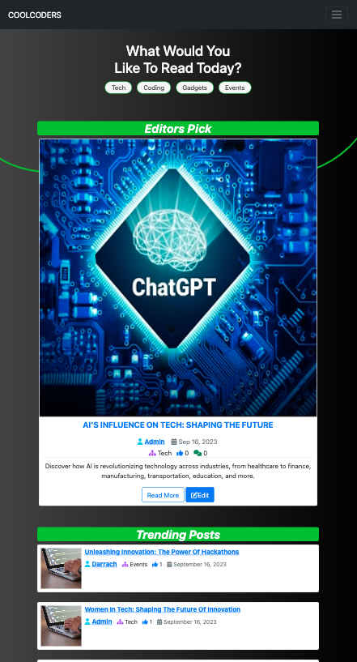
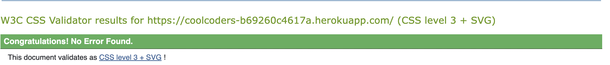
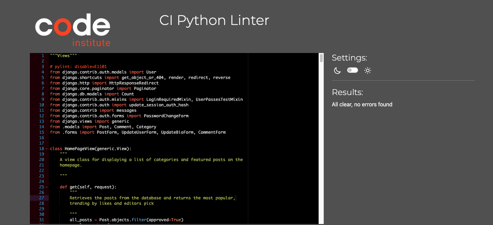
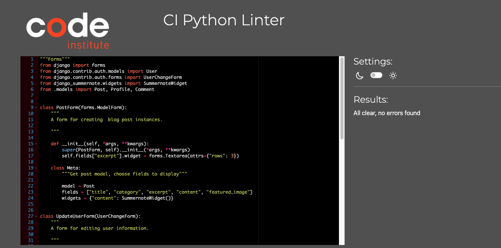
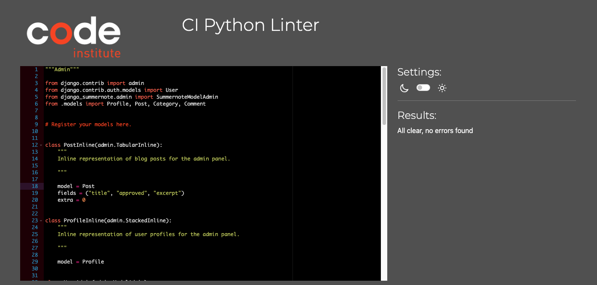
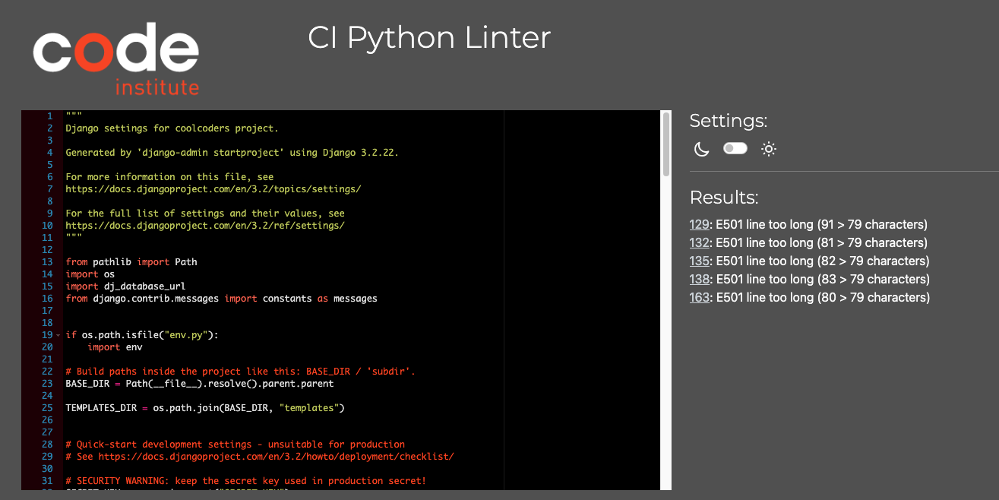

# Table of Contents

- [User Story Testing](#user-story-testing)
- [Code Validation](#code-validation)
  - [HTML](#html)
  - [CSS](#css)
  - [JavaScript](#JavaScript)
  - [Python](#python)
- [Responsiveness](#Responsiveness)
- [Browser Testing](#browser-testing)
- [Device Testing](#device-testing)
- [Lighthouse](#Lighthouse)
- [Manual Testing](#manual-testing)
  - [Site Navigation](#site-navigation)
  - [Home Page](#home-page)

## User Story Testing

| User Story                                                                                                                                                                                                                        | Screenshot                                                                                                  | Result           |
| --------------------------------------------------------------------------------------------------------------------------------------------------------------------------------------------------------------------------------- | ----------------------------------------------------------------------------------------------------------- | ---------------- |
| As a developer I can setup a new Django project so that I can create the project's structure                                                                                                                                      | The project was set up successfully                                                                         | <mark>PASS<mark> |
| As a developer I can connect database and media storage so that the user's stored data is stored successfully                                                                                                                     | Database and storage set up succesfully                                                                     | <mark>PASS<mark> |
| As a developer, I can perform an early deployment of the application to verify the functionality of the initial setup so that I can continue testing the application as it evolves during development.                            | Live site was hosted with no errors                                                                         | <mark>PASS<mark> |
| As a developer I can layout wireframes so that I have a clear idea of the sites structure and theme                                                                                                                               | Wireframers were planned and created as referenced in the [README](./README.md)                             | <mark>PASS<mark> |
| As a developer I can choose a colour theme so that all pages have a consistent feel and style.                                                                                                                                    | A colour theme was chosen for the website as referenced in the [README](./README.md)                        | <mark>PASS<mark> |
| As a user I want the website to be responsive so I can view it on multiple devices                                                                                                                                                | 

Responsive

          | <mark>PASS<mark> |
| As a User I can intuitively navigate through the website so that I can view all content with ease.                                                                                                                                | 

Navigation Bar

 | <mark>PASS<mark> |
| As a User, I can create an account so that I can post, save and edit content                                                                                                                                                      | 

Navigation Bar

 | <mark>PASS<mark> |
| As a User, I can access my account so that I can create and edit content and view my saved information                                                                                                                            | 

Navigation Bar

 | <mark>PASS<mark> |
| As a User, I can log out so that I can secure my account from potential hacks                                                                                                                                                     | 

Navigation Bar

 | <mark>PASS<mark> |
| As a User, I can view my profile page so that I can update my information                                                                                                                                                         | 

Navigation Bar

 | <mark>PASS<mark> |
| As a User, I can post an article so that I can share my insights with the community.                                                                                                                                              | 

Navigation Bar

 | <mark>PASS<mark> |
| As a User, I can edit my articles as the author, so that I can keep my content up to date.                                                                                                                                        | 

Navigation Bar

 | <mark>PASS<mark> |
| As a User, I can create comments on articles, so that I can engage with the content and share my thoughts.                                                                                                                        | 

Navigation Bar

 | <mark>PASS<mark> |
| As a User, I can delete my own comments, so that I can remove unwanted opinions.                                                                                                                                                  | 

Navigation Bar

 | <mark>PASS<mark> |
| As a User, I can view content on the home page so that I can stay informed and explore engaging topics.                                                                                                                           | 

Navigation Bar

 | <mark>PASS<mark> |
| As a User, I can view a selected article with its comments, as well as related articles, so that I can explore in-depth content and engage with the community.                                                                    | 

Navigation Bar

 | <mark>PASS<mark> |
| As a User, I can view articles in a specific category, so that I can explore content that interests me.                                                                                                                           | 

Navigation Bar

 | <mark>PASS<mark> |
| As a User, I can view a user's profile page, displaying their posts, favourites and basic information so that I can learn more about the user and their contributions.                                                            | 

Navigation Bar

 | <mark>PASS<mark> |
| As a User, I can view my favourites on my profile detail page so that I can reread my favourite articles                                                                                                                          | 

Navigation Bar

 | <mark>PASS<mark> |
| As a Developer, I can created a standardised article preview card for each article, providing key information at a glance so that users can quickly understand the context of an article                                          | 

Navigation Bar

 | <mark>PASS<mark> |
| As a User, I can add articles to my favourites so that I can save my most enjoyed articles for future reference.                                                                                                                  | 

Navigation Bar

 | <mark>PASS<mark> |
| As a Site Owner, I can have the capability to perform all CRUD (Create, Read, Update, Delete) functionality within the website's admin interface so that I can manually create and edit content.                                  | 

Navigation Bar

 | <mark>PASS<mark> |
| As the Site Owner, I can approve user created content so that I can manually oversee and manage content creation and edits.                                                                                                       | 

Navigation Bar

 | <mark>PASS<mark> |
| As a Site Owner, I can delete user profiles and all associated content from the platform so I can minimise harmful users.                                                                                                         | 

Navigation Bar

 | <mark>PASS<mark> |
| As a User I can see notification messages when performing CRUD operations or login/logout, signup so that informed about the outcome of the action taken.                                                                         | 

Navigation Bar

 | <mark>PASS<mark> |
| As the Site Owner, I can view users and their profiles/content through the website's admin interface, allowing me to manage site users.                                                                                           | 

Navigation Bar

 | <mark>PASS<mark> |
| As a User, I want to view comments on an article so that I can see the discussions going on a particular topic.                                                                                                                   | 

Navigation Bar

 | <mark>PASS<mark> |
| As a Developer, I want to ensure the styling and theme of the website are consistent, free from CSS errors, and provide an intuitive and easy-to-use UI/UX so that users easily digest content and perform all actions with ease. | 

Navigation Bar

 | <mark>PASS<mark> |
| As a User, I can level up based on the number of posts I have contributed, so that I can be recognised for my active participation and contributions to the community.                                                            | 

Navigation Bar

 | <mark>PASS<mark> |
| As a User, I can delete my account so that I can remove myself, details and all content from the live website                                                                                                                     | 

Navigation Bar

 | <mark>PASS<mark> |

## Code Validation

### HTML

All HTML pages were run through the [W3C HTML Validator](https://validator.w3.org/). See results in below table.

| Page | Validator                                                                                                   | Result            |
| ---- | ----------------------------------------------------------------------------------------------------------- | ----------------- |
| Home | 

Navigation Bar

 | <mark>PASS</mark> |

### CSS

Test Results CSS <mark>PASS<mark>

### JavaScript

Test Results JavaScript <mark>PASS<mark>

### Python

| File     | Validator                                                                                                              | Result            |
| -------- | ---------------------------------------------------------------------------------------------------------------------- | ----------------- |
| Models   | 

Models

     | <mark>PASS</mark> |
| Views    | 

Views

       | <mark>PASS</mark> |
| Forms    | 

Forms

       | <mark>PASS</mark> |
| Urls     | 

Urls

      | <mark>PASS</mark> |
| Admin    | 

Admin

       | <mark>PASS</mark> |
| Settings | 

Settings

 | <mark>PASS</mark> |

Settings.py validation errors of line to line are as a result of the original django configuration set up and not custom code.

## Responsiveness

During development each page was tested using dev tools in Google Chrome. The strategy involved ensuring that every page would adapt to various screen sizes beyond a width of 320px, as opposed to relying on fixed device-specific widths.
Further testing was done on mobile to confirm all is working as expected.

| Device | Screen Size |     Pass/Fail     |               Comment                |
| ------ | :---------: | :---------------: | :----------------------------------: |
| Pro    |   3480px    | <mark>PASS</mark> | All elements are displayed correctly |

## Browser Testing

- The Website was tested on Google Chrome, Firefox, Safari browsers with no issues noted.

## Device Testing

- The website was viewed on a variety of devices such as Desktop, Laptop, iPhone 8, iPhoneXR and iPad to ensure responsiveness on various screen sizes in both portrait and landscape mode. The website performed as intended. The responsive design was also checked using Chrome developer tools across multiple devices with structural integrity holding for the various sizes.

### Lighthouse

Lighthouse validation was run on all pages (both mobile and desktop) in order to check accessibility and performance. At first I received the warning _'Background and foreground colors do not have a sufficient contrast ratio'_ in relation to buttons where I had used the Bootstrap class `btn-info`. After I updated the button styling I received the below scores.

| Page        | Performance | Accessibility | Best Practices | SEO |
| ----------- | :---------: | :-----------: | :------------: | :-: |
|             |             |               |                |     |
| **Desktop** |             |               |                |     |
| Home        |     100     |      100      |      100       | 100 |
|             |             |               |                |     |
| **Mobile**  |             |               |                |     |
| Home        |     100     |      100      |      100       | 100 |

## Manual Testing

### Site Navigation

| Element               | Action | Expected Result   | Pass/Fail |
| --------------------- | ------ | ----------------- | --------- |
| Hero 'Sign Up' Button | Click  | Open Sign up page | Pass      |

### Home Page

| Element               | Action | Expected Result   | Pass/Fail |
| --------------------- | ------ | ----------------- | --------- |
| Hero 'Sign Up' Button | Click  | Open Sign up page | Pass      |
